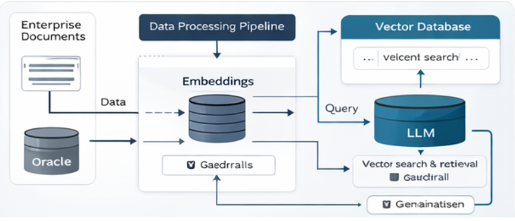

# 🚀 Enterprise RAG System (Config-Driven + ETL)


---

## 📖 Overview
Enterprise-grade **Retrieval-Augmented Generation (RAG)** system with:
- ETL pipeline
- Config-driven architecture
- Multi-LLM support
- Evaluation & logging

---

## 🏗️ Architecture



---

## ⚙️ Features
- 🔄 ETL pipeline for ingestion
- 🧠 Multi-LLM (OpenAI, Ollama)
- 📊 Evaluation framework
- 🧾 Logging & observability
- ⚙️ Config-driven behavior

---

## 🚀 Quick Start

```bash
docker compose down -v
docker compose up -d
docker compose run --rm chat_bot
docker compose run --rm etl_worker
```

---

## 📊 Evaluation
Logs stored in:
```
logs/rag_logs.json
```

---

## 📄 License
MIT License
